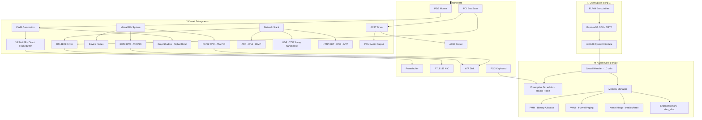

<div align="center">


# EquinoxOS

**A hobby monolithic kernel for x86_64 — with a real GUI, preemptive multitasking, networking, and audio.**

[](LICENSE)
[]()
[]()
[]()
[]()
[]()
[]()
[]()

</div>

---

<div align="center">

### Screenshots


<br><sub>Desktop with Compositing Window Manager, taskbar, and desktop icons</sub>


<br><sub>Paint app with Bresenham rendering + Terminal with command history</sub>


<br><sub>File Explorer navigating EXT2/FAT32 volumes — launching ELF executables</sub>


<br><sub>Running on physical hardware</sub>

</div>

---

## What is EquinoxOS?

**EquinoxOS** is a from-scratch hobby operating system for `x86_64` written in C and NASM. It boots via the Limine bootloader in 64-bit Higher Half mode, runs a compositing window manager with drop shadows and z-ordering, supports true preemptive multitasking with Ring 3 user-space isolation, dual filesystem support (FAT32 + EXT2), a full TCP/IP network stack, AC97 audio, and even runs a port of **DOOM**.

> It's made to be *minimally daily-usable* while staying readable and educational.

---

## 🏗 System Architecture



---

## 🛠 Hardware Support & Features

| Category | Component | Status | Notes |
| :--- | :--- | :---: | :--- |
| **Boot** | Limine Protocol v3 | ✅ | 64-bit Higher Half, memory map, HHDM |
| **CPU** | x86_64 + SSE | ✅ | SSE init (CR0/CR4), used by VESA blitter |
| **Memory — PMM** | Bitmap Allocator | ✅ | Page-granular, `pmm_alloc_continuous()` |
| **Memory — VMM** | 4-Level Paging | ✅ | PML4/PDP/PD/PT, separate user address spaces |
| **Memory — Heap** | `kmalloc` / `kfree` | ✅ | 64 MB kernel heap |
| **Memory — SHM** | Shared Memory | ✅ | `shm_alloc()` for IPC between tasks |
| **Multitasking** | Preemptive Round-Robin | ✅ | IRQ0 (PIT 50 Hz) context switch |
| **User Mode** | Ring 3 Isolation | ✅ | Per-process PML4, TSS, GDT segments |
| **Graphics** | VESA LFB | ✅ | Double-buffered, hardware cursor, alpha blending |
| **GUI** | Compositing WM | ✅ | Z-ordering, drop shadows, window drag |
| **Storage** | ATA PIO | ✅ | Raw sector R/W for both FS drivers |
| **Filesystem** | FAT32 | ✅ | Full Read + Write, 8.3 filenames |
| **Filesystem** | EXT2 | ✅ | Read + Write, stress-tested |
| **ELF Loader** | ELF64 | ✅ | PT_LOAD segments mapped into user PML4 |
| **Network** | RTL8139 | ✅ | PCI scan, raw TX/RX |
| **Network** | ARP / IPv4 / ICMP | ✅ | Full IPv4 stack with ICMP ping |
| **Network** | UDP / TCP | ✅ | UDP datagrams + TCP 3-way handshake |
| **Network** | HTTP / DNS / NTP | ✅ | HTTP GET, DNS resolve, NTP time sync |
| **Audio** | AC97 | ✅ | PCM output via `SYS_AUDIO_PLAY` syscall |
| **Input** | PS/2 Keyboard | ✅ | Scancode-based, shell + app input |
| **Input** | PS/2 Mouse | ✅ | Relative tracking, click detection |
| **PCI** | PCI Bus Scan | ✅ | Vendor/device ID enumeration |
| **Timer** | PIT (8253) | ✅ | 50 Hz tick, `get_time_ms()` |
| **Serial** | COM1 | ✅ | Early boot log + QEMU debug output |

---

## 🖥 Built-in Applications

The OS ships a full desktop environment with the following apps:

| App | Description |
| :--- | :--- |
| **Terminal** | Interactive shell with command history and kernel log streaming |
| **Explorer** | Graphical file manager — lists FAT32/EXT2 files, launches ELF executables |
| **Notepad** | Text editor with **disk save** support (`NOTES.TXT` → FAT32/EXT2) |
| **Paint** | Drawing app with Bresenham line algorithm + **BMP export to disk** |
| **System Monitor** | Real-time RAM usage bar and process overview |

### External Applications (userspace ELF)

| App | How to launch | Description |
| :--- | :--- | :--- |
| `snake.elf` | Explorer / `run snake.elf` | Classic snake game |
| `bmpview.elf` | `run bmpview.elf BG.BMP` | BMP image viewer |
| `htmlview.elf` | Explorer | HTTP browser (no HTTPS) |
| `niplay.elf` | `run niplay.elf terry.wav` | WAV music player via AC97 |
| `luagui.elf` | `run luagui.elf app.lua` | Embedded Lua 5.x script runner |
| `doom.elf` | Explorer | **DOOM** port with AC97 audio |

---

## ⌨️ Developer API (EquinoxOS SDK)

Applications are **ELF64 binaries** linked at `0x1000000`, built with the bundled SDK.
All kernel services are accessed via `int 0x80`.

### Syscall Table

| `RAX` | Name | Description | Key Args |
| :---: | :--- | :--- | :--- |
| `1` | `SYS_PRINT` | Write string to terminal + serial | `rdi`: `char* msg` |
| `2` | `SYS_READ_FILE` | Map file from VFS into user RAM | `rdi`: name, `rsi`: size_out |
| `3` | `SYS_WRITE_FILE` | Save buffer to VFS (FAT32/EXT2) | `rdi`: name, `rsi`: buf, `rdx`: size |
| `5` | `SYS_DRAW_BUFFER` | Blit pixel buffer to compositor window | `rdi/rsi`: x/y, `rdx/rcx`: w/h, `r8`: buf |
| `7` | `SYS_GET_MOUSE` | Get mouse X/Y/buttons from kernel | `rax`: X, `rbx`: Y, `rcx`: buttons |
| `9` | `SYS_GET_SCANCODE` | Pop keyboard scancode (non-blocking) | — |
| `10` | `SYS_EXIT` | Terminate process, reclaim RAM | `rdi`: exit_code |
| `12` | `SYS_GET_FONT` | Map PSF font pointer into user space | — |
| `20` | `SYS_AUDIO_PLAY` | Submit PCM chunk to AC97 driver | `rdi`: buf, `rsi`: size |

### EID v2.0 — Immediate Mode GUI Toolkit

EquinoxOS includes **EID** (Equinox Interface Designer) — an immediate-mode UI toolkit that gives apps full control over their visual style.

```c
#include <eid.h>
#include <equos.h>

eid_ctx_t ui;
uint32_t buffer[400 * 300];

void render() {
    eid_begin(&ui, buffer, 400, 300);
    ui.mx -= win_x;  // Map global → window-relative coords
    ui.my -= win_y;

    uint32_t id    = eid_get_id("OK", 50, 120);
    uint32_t state = eid_process_interaction(&ui, id, 50, 120, 100, 36);

    uint32_t col = (state & EID_STATE_HOVER) ? 0x00FFFF : 0x006666;
    if (state & EID_STATE_ACTIVE) col = 0xFFFFFF;

    eid_draw_rect(buffer, 400, 300, 50, 120, 100, 36, col);
    eid_draw_text(buffer, 400, 300, 68, 130, "OK", 0x000000);

    if (state & EID_STATE_CLICKED) { /* handle */ }
    eid_end(&ui, win_x, win_y);
}
```

> 📖 See [**EID_SDK.md**](EID_SDK.md) for the full API reference, drawing primitives, and best practices.

---

## 📂 Project Structure

```text
EquinoxOS/
├── src/
│   ├── kernel.c                     # kmain() — boot entry, subsystem init
│   ├── api.h                        # EquinoxAPI struct (app ↔ kernel contract)
│   ├── boot/limine/                 # Limine protocol headers
│   ├── gui/
│   │   ├── gui.c / gui.h            # Compositing Window Manager
│   │   ├── gui_apps.c               # Built-in app UIs (Paint, Notepad, Explorer…)
│   │   └── terminal.c               # Shell terminal widget
│   ├── syslibc/                     # Kernel-side stdio + string helpers
│   └── system/
│       ├── core/                    # GDT, IDT, PIC, interrupt stubs (NASM)
│       ├── mem/
│       │   ├── pmm.c                # Bitmap Physical Memory Manager
│       │   ├── vmm.c                # 4-level Virtual Memory Manager
│       │   ├── memory.c             # kmalloc / kfree heap
│       │   └── shm.c                # Shared Memory
│       ├── usr/
│       │   ├── task.c               # Scheduler + context switch
│       │   └── syscall.c            # int 0x80 dispatch table
│       ├── fs/
│       │   ├── vfs.c / vfs.h        # Virtual File System abstraction
│       │   ├── fat32.c              # FAT32 driver (R/W)
│       │   ├── ext2.c               # EXT2 driver (R/W)
│       │   └── elf.h                # ELF64 loader structures
│       ├── drivers/
│       │   ├── vesa/                # VESA LFB, BMP encoder, PSF font
│       │   ├── devices/
│       │   │   ├── audio/ac97.c     # AC97 PCM audio driver
│       │   │   ├── keyboard/        # PS/2 keyboard (scancodes)
│       │   │   ├── mouse/           # PS/2 mouse (relative tracking)
│       │   │   ├── pci/             # PCI bus scan
│       │   │   └── pcspeaker/       # PC Speaker beeper
│       │   └── hardware/
│       │       ├── net/             # RTL8139 · ARP · IPv4 · TCP · UDP · DNS · HTTP · NTP
│       │       ├── disk/            # ATA PIO disk driver
│       │       └── serial/          # COM1 serial (QEMU log)
│       ├── misc/timer.c             # PIT 8253 timer
│       └── shell/                   # Shell command parser
├── app/
│   ├── snake.c                      # Snake game
│   ├── bmpview.c                    # BMP image viewer
│   ├── htmlview.c                   # HTTP browser
│   ├── niplay.c                     # WAV music player
│   ├── luagui.c                     # Lua script runner
│   └── doom/                        # DOOM port (doomgeneric)
├── sdk/
│   ├── include/                     # equos.h, eid.h, syscall wrappers
│   ├── lib/                         # CRT0 (_start), syscall stubs
│   ├── lua/                         # Lua 5.x source (stripped)
│   └── codec/                       # WAV/audio codec helpers
├── iso_root/                        # Bootable ISO staging area
│   ├── sys/kernel.elf
│   ├── bin/                         # Compiled ELF userspace apps
│   └── res/                         # Fonts, wallpapers, assets
├── Makefile                         # Windows build (mingw/msys2 cross-compiler)
├── Makefile-linux                   # Linux build
├── WINDOWS_ext2.py                  # Python script — generates hdd.img (EXT2)
├── EID_SDK.md                       # Full EID + Syscall reference
└── ROADMAP.md                       # Development phases & milestones
```

---

## 🚀 Quick Start

### Prerequisites

| Tool | Purpose |
| :--- | :--- |
| `x86_64-elf-gcc` | Cross-compiler (freestanding, no stdlib) |
| `nasm` | Assembler for interrupt stubs & CRT0 |
| `x86_64-elf-ld` | Linker |
| `xorriso` | ISO image creation |
| `python3` | EXT2 disk image generation |
| `qemu-system-x86_64` | Virtual machine for testing |

### Build & Run

```bash
# 1. Clone the repo
git clone https://github.com/ewasion137/EquinoxOS.git
cd EquinoxOS

# 2. Build kernel + all apps + create ISO + HDD image
make all

# 3. Launch in QEMU (512 MB RAM, RTL8139, AC97 audio)
make run
```

> **Windows users:** Use the `Makefile` (tested with msys2/mingw toolchain).  
> **Linux users:** Use `Makefile-linux`.

### Individual Build Targets

```bash
make kernel.elf   # Build kernel only
make apps         # Build all userspace ELF apps
make doom.elf     # Build DOOM port
make iso          # Package bootable ISO
make create_hdd   # Generate hdd.img (EXT2) via Python script
make clean        # Remove all build artifacts
make cleanrun     # clean + all + run
```

### Debugging

```bash
# addr2line to map a fault RIP to source
x86_64-elf-addr2line -e kernel.elf <RIP_ADDRESS>

# QEMU serial log is written to qemu.log automatically
# and streamed to stdout via -serial stdio
```

The kernel outputs a full boot log to COM1 (visible in QEMU terminal):
```
=== EquinoxOS Kernel Starting ===
HHDM offset initialized
GDT initialized  |  SSE initialized  |  PMM initialized
VMM initialized  |  Heap initialized |  VESA initialized
IDT initialized  |  PIC remapped     |  Timer initialized
Task system initialized  |  VFS initialized
FAT32 initialized  |  EXT2 initialized
PCI initialized  |  GUI initialized  |  Shell initialized
=== EquinoxOS Ready ===
```

---

## 🗺 Roadmap

> Full details in [ROADMAP.md](ROADMAP.md)

### ✅ Completed

- [x] x86_64 Higher Half kernel via Limine
- [x] Bitmap PMM + 4-level VMM + kernel heap
- [x] VESA LFB with compositing WM, alpha shadows, Z-ordering
- [x] Preemptive Round-Robin scheduler (IRQ0)
- [x] Ring 3 user mode with isolated address spaces
- [x] GDT / IDT / TSS — proper kernel+user segments
- [x] FAT32 read + write support
- [x] EXT2 read + write support
- [x] VFS abstraction layer
- [x] ELF64 loader → Ring 3 jump
- [x] Syscall interface (`int 0x80`, 10 calls)
- [x] RTL8139 NIC driver + full TCP/IP stack (ARP, IPv4, TCP, UDP, DNS, NTP, HTTP)
- [x] AC97 audio driver with software mixer
- [x] PS/2 keyboard & mouse
- [x] DOOM port with audio
- [x] Lua 5.x embedded interpreter (as userspace app)
- [x] HTTP browser (`htmlview.elf`)
- [x] PSF font rendering
- [x] Shared Memory (`shm_alloc`)

### 🔧 In Progress / Planned

- [ ] HAL — hardware abstraction layer (decouple VESA/VGA/VirtIO)
- [ ] AHCI/SATA driver (replace aging ATA PIO)
- [ ] GPT partition table parsing
- [ ] SSE/AVX-accelerated window compositing
- [ ] Advanced UI widgets (checkboxes, text inputs, animations)
- [ ] TrueType / PSF2 font rendering
- [ ] IPC — pipes and message queues
- [ ] Thread-safe mutexes & semaphores
- [ ] Port `mlibc` / `newlib` as full libc
- [ ] Self-hosting (EquinoxOS compiling EquinoxOS)
- [ ] USB stack (UHCI/EHCI/XHCI)
- [ ] HTTPS (TLS)
- [ ] Own filesystem format
- [ ] OS installable/archiveable

---

## 👥 Contributors

| | Handle | Role |
| :---: | :--- | :--- |
| 👑 | **[@ewasion137](https://github.com/ewasion137)** | Lead Developer |
| ⭐ | **@oxtiskz** | Special Thanks *(account deleted)* |
| ⭐ | **[@gobgolaxi](https://github.com/gobgolaxi)** | Contributor |
| ⭐ | **[@Offihito](https://github.com/Offihito)** | Contributor |
| ⭐ | **[@Lertov2424232](https://github.com/Lertov2424232)** | Contributor |

---

<div align="center">

[](LICENSE)
[](https://github.com/ewasion137/EquinoxOS/stargazers)
[](https://github.com/ewasion137/EquinoxOS/network/members)
[](https://github.com/ewasion137/EquinoxOS/commits)

*Built from scratch, for the love of low-level programming.*

</div>
